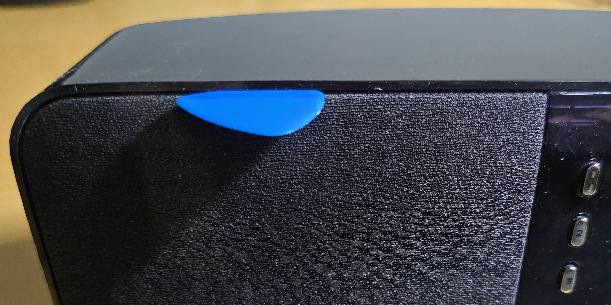
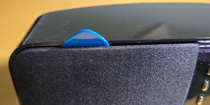
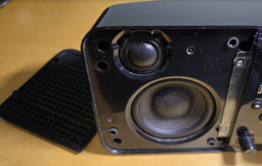

# SqueezeboxRadioHwWiFi6Fix
Squeezebox Radio WiFi6 hardware based fix - Installation of a WiFi LAN bridge

# Squeezebox Radio - Einbau WiFi-LAN-Bridge 
## Warum?
Seit der Einführung von WiFi6 gibt es Probleme mit dem SqueezeboxRadio.
Der eingebaute WiFi-Chip scheint sich in unregelmäßigen Abständen aufzuhängen. Ein Neustart ist notwendig, um die Verbindung neu aufzubauen. Laut Beobachtungen von Usern des Squeezebox-Forums kommt dies sogar vor, wenn man selbst kein WiFi6 betreibet, es reicht wohl, wenn ein fremdes WiFi Netz in der Gegend WiFi6 verwendet.

Siehe Thread: https://www.squeezebox-forum.de/viewtopic.php?t=3990

Laut einigen Usern soll die Community-Firmware Version 8.5.0-r16962 das Problem lösen. Vermutlich wird in dieser Version der WiFi-Chip bei einem Abbruch neu initialisiert. Dies passiert solange der Buffer genügend gefüllt ist, um eine Unterbrechung zu verhindern. (Das ist nur meine Vermutung der Funktionsweise!)

Ich habe diesen Lösungsansatz nicht weiterverfolgt, da für mich die unten beschriebene Hardware-Lösung einfach einzubauen ist und die WiFi-LAN-Bridge auf moderne WiFi-Empfangstechnologie setzt.

Laut einem User soll wohl die oben erwähnte Community-Firmware Version auch weiterhin Probleme haben, insbesondere wenn man ein FRITZ!box Mesh mit Repeatern betreibet.

Siehe: https://www.squeezebox-forum.de/viewtopic.php?p=28082#p28082

## Haftung
Keine Ahnung, warum ich das hier schreibe, der XMV* müsste einem das Folgende eigentlich selbst sagen:
Ich übernehme keinerlei Haftung für Schäden am SqueezeboxRadio, am Werkzeug noch für Schäden an Leib und Leben oder Schäden am Rest des Universums. Jede die dieser Anleitung folgt, ist für ihr Handeln selbst verantwortlich.
Auch werde ich nur Support leisten, wenn es mir meine freie Zeit erlaubt und ich gerade Bock darauf habe.

(* XMV = Xunder Menschen Verstand)

## Material
-	WiFi-LAN-Bridge
  Hersteller: TP-Link
  Bezeichnung: 300Mbps Wireless N Nano Router
  Typ: TL-WR802N
  Link: https://www.tp-link.com/de/home-networking/wifi-router/tl-wr802n/
-	rote und schwarze flexible Litze
-	TX8 Schraubendreher
-	TX10 Schraubendreher
-	Plektrum (oder anderes dünnes Kunststoffteil)
-	Feiner Lötkolben und Lötzinn
-	Ggf. Kopflupe
-	Heißkleber
-	Kleine Bohrmaschine, um das Loch für die Versorgungslitzen zu bohren
-	Klebeband

# Umbauanleitung
## Öffnen des SqueezboxRadios
1. Abnehmen der Lautsprecherblende
Hierbei kann ein Plektrum sehr hilfreich sein.

2.	Gummiteil an der Netzwerkbuche entfernen
Dies lässt sich einfach mit einem Schlitzschraubendreher heraushebeln.
